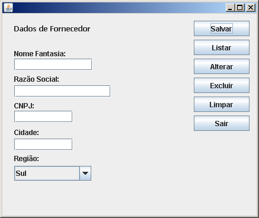
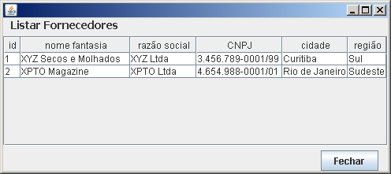

# Exercício - Sistema de Cadastro de Fornecedores para Desktop em Banco MySQL utilizando DAO para a IDE NetBeans.

## Contextualização

 - O projeto foi desenvolvido no NetBeans deve ser chamado exercicio_cadastrofornecedor_desktop_bd_dao_netbeans. 
 - Programa desenvolvido no Java Development Kit 1.8. 
 - Utiliza o Apache Maven para a automatização da construção. 
 - Este programa possui diversas classes organizada nos pacotes: principal, visao, modelo e dao. 
 - Utiliza o Data Acess Object (DAO) para abstrair o bancos de dados MySQL. 
 - Toda iteração com banco de dados é tratada diretamente pelo DAO. 
 - Os dados de configuração(Servidor, Database, Usuario, Senha) da integração do java com o banco de dados estão no arquivo src/dao/DadosBanco.java. 
 - Dependência do Driver JDBC foi especificada no arquivo pom.xml. 
 - O Driver de conexão com o MySQL e espeficado na classe Conexao.java. 
 - Crie o banco de dados antes de executar o programa, as especificações da tabela estão no arquivo banco.sql. 
 - A pasta src contêm os fontes do projeto. 
 - A interface gráfica foi construída **com** o auxílio da IDE NetBeans. 

## Arquivos

- banco.sql - Script do banco de daddos.
- pom.xml - Arquivo de configuração da ferramenta de automação Maven.

## Enunciado do problema

### Questão 1

Uma empresa necessita de um sistema para desktop em Java para cadastrar os seus fornecedores em um banco de dados. As informações que cada fornecedor deve preencher são as seguintes: Nome Fantasia, Razão Social, CNPJ, Cidade e Região. O campo “região” deve usar uma caixa de escolha para as opções Sul, Sudeste, Centro-Oeste, Norte e Nordeste. A tabela e o banco de dados têm o nome “fornecedor”. A tabela tem a seguinte estrutura:

CREATE TABLE fornecedor (
	fornecedorID    INTEGER NOT NULL AUTO_INCREMENT,    	 
	nomeFantasia    VARCHAR(50) NOT NULL,     
	razaoSocial     VARCHAR(50) NOT NULL,     
	CNPJ    	VARCHAR(20),	
	cidade       	VARCHAR(25),
	regiao       	VARCHAR(20),
	PRIMARY KEY(fornecedorID)    
);

O layout da janela é apresentado abaixo:

Este interface gráfica, além dos campos, possui seis botões. O botão com o nome "Sair" fecha a janela e sai do sistema. O botão com o nome “Limpar” limpa as caixas de texto da janela. Quando for clicado, o botão “Salvar” enviará as informações ao banco de dados. A caixa de texto para a razão social deve ter o seu preenchimento obrigatório, faça a validação. As funcionalidades dos outros botões serão implementadas posteriormente.

Desenvolva uma interface gráfica baseada em JFrame do pacote Swing para o cadastro de fornecedores, contendo as informações acima. Utilize o banco de dados de sua preferência. Ao final do processamento deve ser exibida uma mensagem informando se o usuário conseguiu ou não realizar a inclusão dos dados.

Você deve apresentar todo o código fonte utilizado para desenvolver a interface e a inclusão no banco de dados. Outras janelas podem ser criadas para integrar as funcionalidades do sistema se for necessário.

### Questão 2

Você já realizou a inclusão dos dados de fornecedores no banco de dados na questão 1. Agora, a mesma empresa necessita listar os dados de seus fornecedores que estão armazenados no banco de dados. A chamada desta funcionalidade será através do botão chamado “Listar” da questão anterior. As informações e o layout dos dados a serem exibidos são apresentados na figura abaixo:

   

Desenvolva uma interface gráfica baseada em JFrame que contêm um componente JTable para exibir os dados de fornecedores armazenados.  Utilize o mesmo banco e tabela da questão 1. Ao se clicar no botão “Fechar” deve se retornar a janela anterior.

Você deve apresentar todo o código fonte utilizado para desenvolver o cadastro. Outras interfaces gráficas podem ser criadas para integrar as funcionalidades do sistema.

### Questão 3

Após realizar a listagem dos dados na questão 2, a empresa necessita disponibilizar uma interface gráfica para a alteração dos dados de seus fornecedores que estão armazenados no banco de dados. Para localizar o fornecedor cujos dados devem ser alterados é necessário ser informado um o id do fornecedor. A interface deve ter o seguinte formato:

 

Esta interface gráfica deve ser chamada pelo botão “Alterar” da interface gráfica da questão 1.

Logo após a digitação do id os dados do fornecedor devem ser exibidos na interface gráfica desenvolvida na questão 1 para que sejam alterados. Se o id do fornecedor não existir, deve ser exibida uma mensagem ao usuário. O botão “Cadastrar” altera os dados do fornecedor. Utilize o mesmo banco e tabela da questão 1. 

Você deve apresentar todo o código fonte utilizado para desenvolver o cadastro. Outras interfaces gráficas podem ser criadas para integrar as funcionalidades do sistema.

### Questão 4

Com as funcionalidades de inclusão, listagem e alteração dos dados de fornecedores prontas, agora a empresa necessita disponibilizar a interface gráfica para a exclusão dos dados de fornecedores que estão armazenados no banco de dados. Para localizar o fornecedor a ser excluído do banco de dados é necessário ser informado um id de fornecedor. A interface gráfica deve ter o seguinte formato:

 

Esta interface gráfica deve ser chamada pelo botão “Excluir” da interface gráfica da questão 1.

Logo após a digitação do id, todos os dados do fornecedor que foi localizado deve ser exibido na interface gráfica desenvolvida na questão 1 e logo após é exigido a confirmação da exclusão com a interface a seguir:

 

Se o id do fornecedor não existir, deve ser exibida uma mensagem ao usuário. Utilize o mesmo banco e tabela da questão 1. 

Você deve apresentar todo o código fonte utilizado para desenvolver o cadastro. Outras interfaces gráficas podem ser criadas para integrar as funcionalidades do sistema. 
